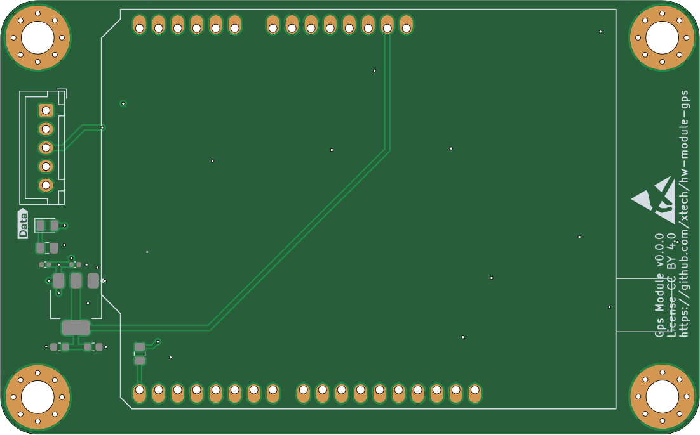
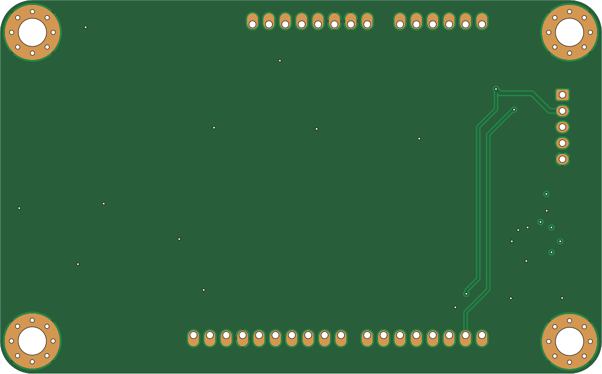
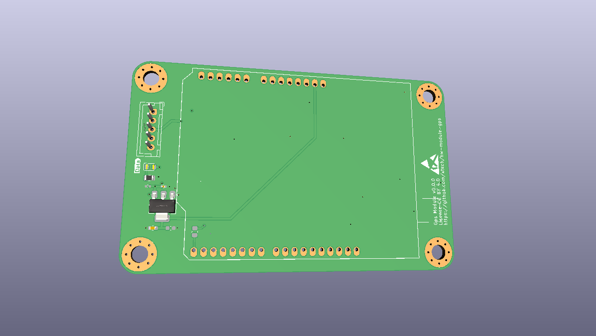

# hw-module-gps — OpenMower GPS Module


A KiCad PCB design for a GPS module intended for the OpenMower universal mainboard. Part of the [OpenMower project](https://github.com/clemensElflein/openmower) — open-source RTK GPS lawn mowing robotics.

---

## Board Preview

| Top | Bottom |
|-----|--------|
|  |  |

3D render:



---

## Repository Structure

```
.
├── hw-module-gps.kicad_sch   # Schematic
├── hw-module-gps.kicad_pcb   # PCB layout
├── hw-module-gps.kicad_pro   # KiCad project
├── .kibot.yaml               # KiBot automation config
├── release/                  # Generated production files
│   ├── hw-module-gps-JLCPCB.zip       # Gerbers for JLCPCB
│   ├── hw-module-gps_bom_jlc.csv      # BOM (JLCPCB format)
│   ├── hw-module-gps_cpl_jlc.csv      # Pick-and-place (JLCPCB format)
│   ├── hw-module-gps-schematic.pdf    # Schematic PDF
│   └── hw-module-gps-ibom.html        # Interactive BOM
├── 3d/                       # Custom 3D models
├── xcore-lib/                # Custom symbol library
└── logos/                    # SVG assets used on PCB silkscreen
```

---

## Ordering from JLCPCB

All production files are pre-generated in `release/`:

1. Upload `release/hw-module-gps-JLCPCB.zip` as gerbers
2. Enable **PCB Assembly**, upload:
   - `release/hw-module-gps_bom_jlc.csv` as BOM
   - `release/hw-module-gps_cpl_jlc.csv` as CPL
3. Use `release/hw-module-gps-ibom.html` (open in browser) to verify component placement

---

## Regenerating Release Files

Requires Docker.

```bash
./run-kibot-docker.sh
```

This runs [KiBot](https://github.com/INTI-CMNB/KiBot) via `ghcr.io/inti-cmnb/kicad9_auto:1.8.5` and regenerates all files in `release/`.

---

## Opening the Design

Requires [KiCad 9](https://www.kicad.org/). Open `hw-module-gps.kicad_pro`.

---

## Legal

Before building a robot using these designs, verify that doing so is permitted in your jurisdiction. Patents and local regulations may apply.

The files are distributed **without any warranty** — no guarantee of safety, legality, or correct function. You need the technical knowledge to evaluate and use this design. The author is not liable for any damages.

## License

<a rel="license" href="http://creativecommons.org/licenses/by/4.0/"></a><br />
Licensed under <a rel="license" href="https://creativecommons.org/licenses/by/4.0/">Creative Commons Attribution 4.0 International</a>.
